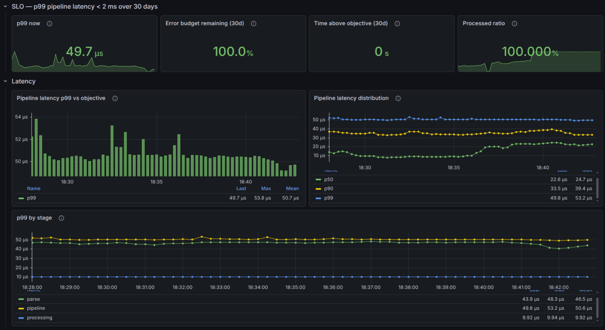

# low-latency-observability

> Real-time market data ingestion pipeline (Binance `aggTrade`), instrumented to measure latency at p99.9, with SLO, error budget and alerting on Kubernetes.

<!-- TODO: add badge once CI is in place
[](https://github.com/Rysekk/low-latency-observability/actions)
-->

An SRE learning project built end to end, from instrumented Go code to a persistent Kubernetes cluster, documenting every trade-off along the way. The goal is not business functionality but the observability chain itself and the compromises it forces in a low-latency environment.

---

## Architecture

```
Binance WebSocket Stream (aggTrade / BTCUSDT)
         │  push, persistent connection
         ▼
  ┌──────────────────────────────────────────┐
  │  Go application                          │
  │                                          │
  │  readStream goroutine                    │
  │         │                                │
  │         ▼  buffered channel (128)        │
  │      [ ■ ■ ■ □ □ ]  full -> DROP         │
  │         │           + ingest_messages_   │
  │         │             dropped_total      │
  │         ▼                                │
  │  parse -> processing                     │
  │    │         │                           │
  │    └────┬────┘                           │
  │         ▼  HistogramVec{stage}           │
  │      /metrics  (:8080)                   │
  └─────────┬────────────────────────────────┘
            │ scrape
            ▼
  ┌──────────────────────┐      ┌──────────────────────┐
  │  Prometheus          │<-----|  Grafana             │
  │  recording rules     │      │  provisioned         │
  │  alerting rules      │      │  dashboards (Git)    │
  │  TSDB PVC, 30d       │      │  PVC (SQLite)        │
  └──────────┬───────────┘      └──────────┬───────────┘
             │                             │
             └──────────┬──────────────────┘
                        ▼
                 Traefik (Ingress)
             prometheus.local / grafana.local
```

**Cluster**: k3d, namespace `trading-app`. One Deployment and one Service per component, persistent volumes through the `local-path` StorageClass.

---

## SLO and error budget

| | |
|---|---|
| **SLI** | Latency of the `pipeline` stage (receive to end of processing), measured with a histogram |
| **SLO** | p99 below **2 ms** over a rolling **30 day** window |
| **Error budget** | Roughly 43 min per month of allowed breach |
| **Alert** | `high_latency_pipeline_p99`, fires after `for: 10m` above the threshold |
| **Actual window** | Started on 2026-08-11, when the TSDB became persistent. Before that, any 30 day SLO was fictional |

SLIs are materialised as **versioned recording rules** (`ingest:processed_ratio`, `ingest:pipeline_latency_p99`) rather than computed on the fly in Grafana, so the SLI definition travels with the code and survives infrastructure migrations.

<!-- TODO: insert a screenshot of the "Pipeline Latency / SLO" dashboard

-->

---

## Notable trade-offs

Every technical decision is recorded in [`docs/decisions.md`](docs/decisions.md). The three most structural ones:

**[Backpressure strategy: drop rather than block](docs/decisions.md#6-backpressure-drop-rather-than-block)**
When the channel is full, the incoming message is discarded and a counter is incremented. Blocking guarantees zero loss but leaves latency unbounded. In a low-latency context, bounded latency outweighs completeness.

**[`strategy: Recreate` instead of a rolling update](docs/decisions.md#11-strategy-recreate)**
With a single replica and `maxSurge: 1`, a rolling update opens two Binance WebSockets at once during the switchover. Both feeds are aggregated into the recording rules, so the SLIs are corrupted with no visible symptom. `Recreate` causes a gap of a few seconds instead. Between losing data and holding wrong data, the gap wins: a gap is detectable (`absent_over_time`), silent contamination is not. Budgeted cost: about 1 min per deployment.

**[Burstable QoS with no CPU limit](docs/decisions.md#12-burstable-qos)**
`requests = limits` on memory (incompressible, exceeding it means OOMKill), `requests` only on CPU. A CPU limit triggers CFS throttling, which freezes the container until the end of the 100 ms period, a stall of up to **50 times the p99 SLO**. Accepted downside: without a limit, the pod can starve its neighbours on the node.

---

## Timeline

| | |
|---|---|
| **Jul 11** | First real-time feed received (`aggTrade` WebSocket) |
| **Jul 19** | Three-stage instrumentation, full Go to Prometheus to Grafana chain working |
| **Jul 25** | Multi-stage `scratch` image (~8.5 MB), docker-compose stack |
| **Jul 26** | SLO and SLIs formalised: recording rules plus alerting rule, Pending to Firing cycle validated |
| **Aug 02** | Kubernetes migration (k3d) for the Go app and Prometheus, graceful SIGTERM shutdown |
| **Aug 10** | Grafana provisioned as code, read-only root filesystem |
| **Aug 11** | Persistent volumes (dynamic PVCs), start of the real SLO window |
| **Aug 15** | Exposure through Ingress and Traefik, port-forwards retired |
| **Aug 28** | CI GitHub Actions green tests on push on the main branch |
| **Aug 29** | Convert trades to domain types (decimal, time.Time), real processing stage, associated tests, CI GitHub Actions completed (lint, test, build, push ghcr au SHA), gate needs on the tests job |
| **Aug 30** | CI to GitOps completed, build docker image with SHA commit as a tag, deploy in the cluster automaticaly with ArgoCD |
| **Sep 5** | app-of-apps ArgoCD, and auto GitOps (prune and selfHeal) on the stack and add path to the ci to build only when the application code change, Makefile have been reduced to a bootstrap role with kubectl wait. Bootstrap validate from scratch with a new cluster |

---

## Running locally

### Prerequisites

- Docker
- [k3d](https://k3d.io/), kubectl, Helm
- Local host entries so the ingress domains resolve:

```
127.0.0.1 grafana.local
127.0.0.1 prometheus.local
```

### 1. Create the cluster

```bash
k3d cluster create local-dev \
  --agents 2 \
  --port "80:80@loadbalancer" \
  --k3s-arg "--disable=traefik@server:*"
```

Port 80 is mapped onto the k3d load balancer so host traffic reaches the Traefik Service. Without that mapping, a `LoadBalancer` Service inside the cluster stays unreachable from the host regardless of how Traefik was installed. The mapping can also be added later with `k3d cluster edit local-dev --port-add "80:80@loadbalancer"`, which recreates the load balancer container.

Only HTTP is exposed at this stage, since the stack runs without TLS (see [known limitations](#known-limitations)). Adding 443 later follows the same pattern.

`--disable=traefik` turns off the Traefik bundled with k3s, so its version and configuration are managed explicitly through Helm in the next step.

The two agent nodes matter: Prometheus and Grafana volumes are provisioned by `local-path` with a node affinity pinned to whichever node first scheduled the pod (see [ADR 22](docs/decisions.md#22-dynamic-pvc-instead-of-a-static-hostpath-pv)). Recreating the cluster discards those volumes and resets the SLO window.

> **Alternative**: keeping the bundled Traefik (dropping `--disable=traefik`) also works and skips step 2. The port mapping is required either way. See [ADR 24](docs/decisions.md#24-ingress-through-a-manually-installed-traefik) for why this project installs it manually.

### 2. Install Traefik

```bash
helm repo add traefik https://traefik.github.io/charts
helm repo update

helm install traefik traefik/traefik \
  --namespace traefik --create-namespace \
  --version 41.0.0 \
  -f traefik-values.yaml
```

```yaml name=traefik-values.yaml
service:
  type: LoadBalancer
ports:
  web:
    port: 80
  websecure:
    port: 443
ingressClass:
  enabled: true
  isDefaultClass: true
```

`isDefaultClass: true` lets the Ingress resources omit an explicit `ingressClassName`.

Check that the Service has been assigned an external address, which is how the k3d load balancer forwards host traffic:

```bash
kubectl get svc -n traefik traefik
```

### 3. Deploy the stack

```bash
make up
```

The target applies `deploy/k8s/namespace.yaml` first, then every manifest in `deploy/k8s/`. Nothing is built locally: the application image is pulled from `ghcr.io/rysekk/low-latency-observability` at the tag pinned in the Deployment.

Services are then available at http://grafana.local and http://prometheus.local

```bash
kubectl get pods -n trading-app
```

---

## Stack

**Application**: Go 1.26, `coder/websocket`, `prometheus/client_golang`

**Observability**: Prometheus (recording and alerting rules), Grafana (provisioned through ConfigMaps)

**Infrastructure**: Kubernetes (k3d), Traefik, `local-path` PVCs

**Distribution**: multi-stage `scratch` image (~8.5 MB), published to `ghcr.io/rysekk/low-latency-observability`

---

## Known limitations

Deliberately out of scope at this stage, listed so there is no ambiguity about what is and is not done:

- Prometheus exposed without access control, Grafana in anonymous-admin mode, HTTP without TLS
- Single replica: scaling a WebSocket horizontally would duplicate the feed and require sharding, which is not warranted at a few hundred msg/s
- Local cluster (k3d), no EKS deployment yet

Planned work: [`docs/backlog.md`](docs/backlog.md)

---

## Documentation

- [`docs/decisions.md`](docs/decisions.md): technical decision records
- [`docs/backlog.md`](docs/backlog.md): planned work and accepted debt